# Account management : CQRS & Event Sourcing

> Réalisé par : HACHMI Mohamed Amine

### I. Structure du projet :

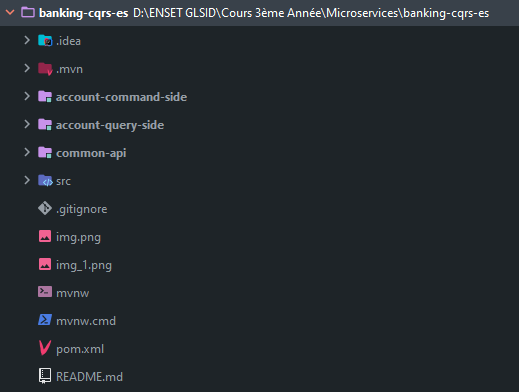

1. Common API :

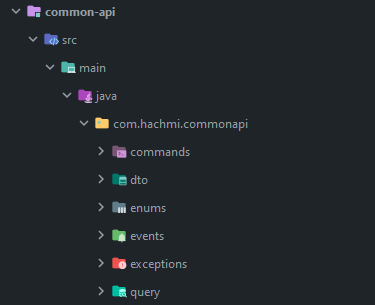

2. Account Command Side :

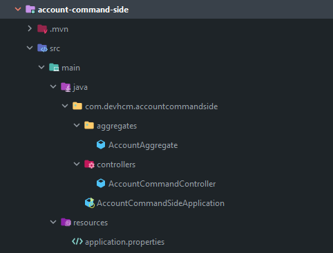

3. Account Query Side :

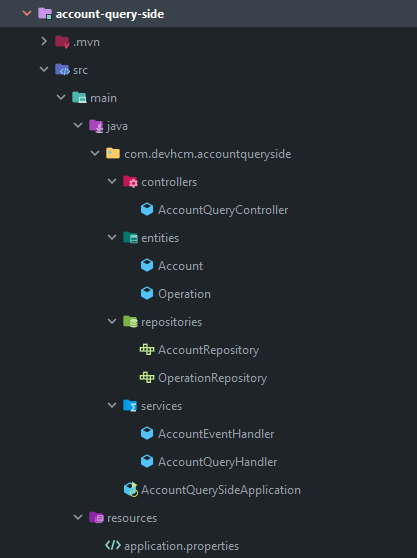

### II. Axon Framework :
J'ai ensuite lancé le serveur Axon, et ajouté des CommandBus pour AccountQuerySide et AccountCommandSide :

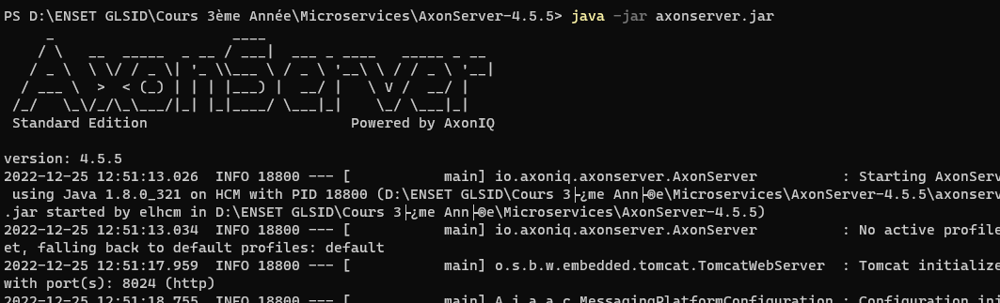

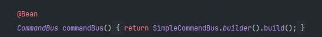

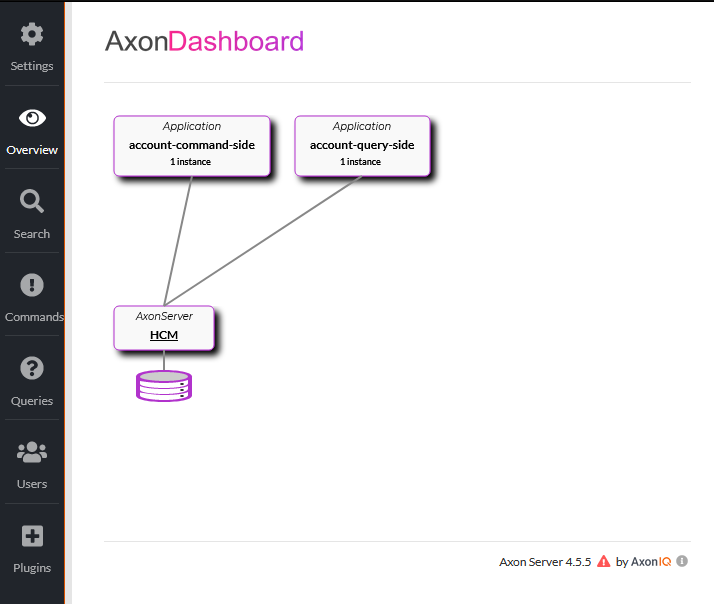

### III. Execution :

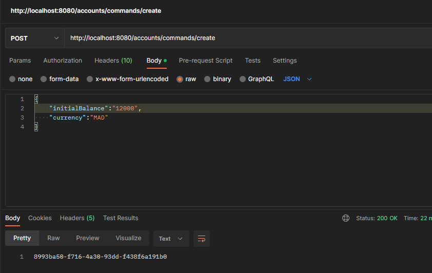

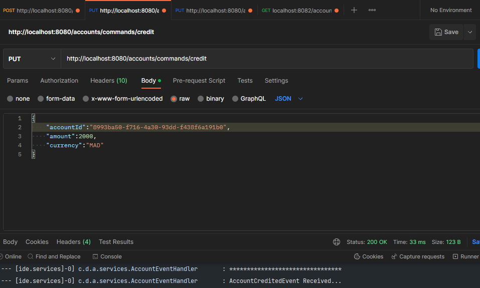

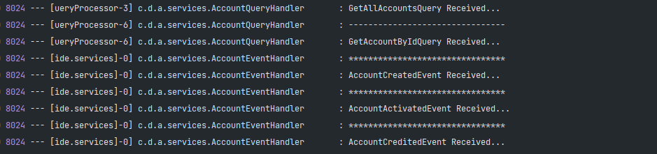

******************************
-> Erreur !
J'ai rencontré l'erreur suivante concernant la requête GetAllAccounts et GetAccountById

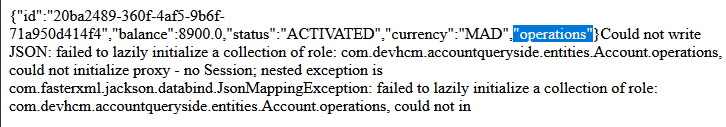

-> Solution : 
pour résoudre le problème, j'ai ajouté une méthode
```
List<Operation> findOperationsByAccount(Account a);
```
au niveau de OperationRepository, et elle permet de récupérer les opérations d'un compte.
Puis je l'ai utilisé au niveau du service AccountQueryHandler.

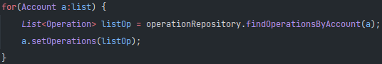

******************************

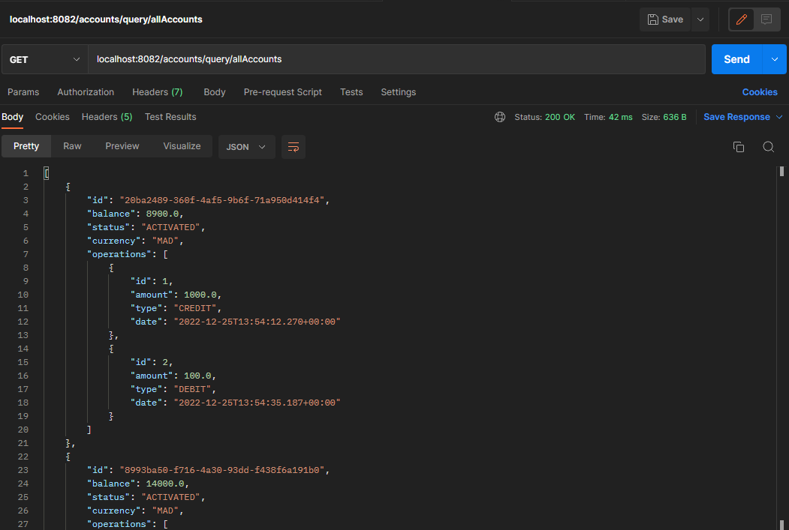

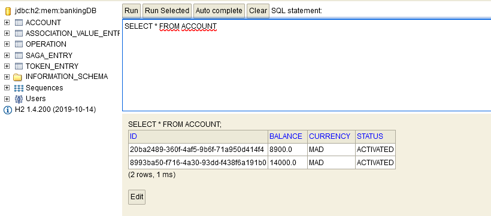
